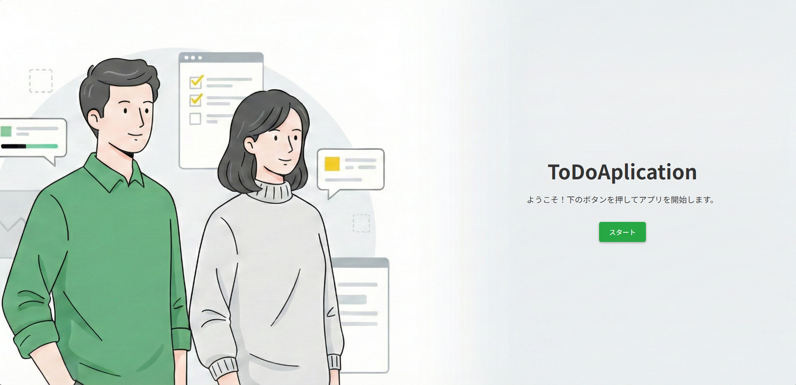

# ToDo Application

これは、HTML、CSS、JavaScriptで作成された、シンプルで直感的なToDo管理アプリケーションです。

## 概要

JavaScriptの学習を兼ねて制作した、シングルページWebアプリケーションです。

## 主な機能 (工夫した点)

<table>
  <tr>
    <td width="50%">
  <h3>ユーザー認証・ログイン機能</h3>
  
メールアドレスとパスワードによるログイン機能を実装。ユーザーごとに個別のタスクデータを管理できるよう設計しています。

    
</td>
    <td width="50%">
  <h3>直感的なタスク管理機能</h3>
  
入力フォームにテキストを入力し、追加ボタン（またはEnterキー）を押すだけで即座にリストへ反映されます。スムーズな操作感にこだわりました。

  　
</td>
  </tr>
  <tr>
    <td width="50%">
      <h3>リアルタイムな完了ステータス管理</h3>
      
チェックボックスをクリックすることで、完了・未完了を視覚的に切り替えられます。完了したタスクには打ち消し線を引き、達成感を得やすくしています。

      
    </td>
    <td width="50%">
      <h3>スムーズなタスク削除機能</h3>
      
各タスクの横に配置された削除ボタンから、ワンクリックで不要なタスクを整理できます。

      
    </td>
  </tr>
    <tr>
    <td width="50%">
      <h3>データの永続化 (Local Storage対応)</h3>
      
ブラウザのローカルストレージを利用しているため、ページをリロードしたりブラウザを閉じたりしても、入力したタスクが消えることはありません。

      
    </td>
    <td width="50%">
      <h3>レスポンシブデザイン</h3>
      
PCブラウザだけでなく、スマートフォンやタブレットの画面サイズにも最適化。外出先でも手軽にタスクを確認・更新できる設計です。。

      
    </td>
  </tr>
</table>

## 使い方

1.  このリポジトリをクローンします。
2.  `index.html` ファイルをウェブブラウザで開きます。
